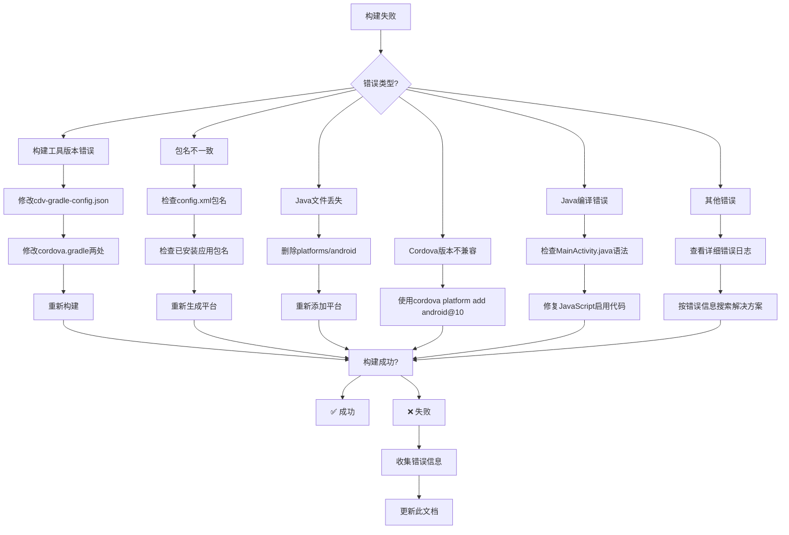

# 问题排查指南

## 🚨 快速问题诊断流程图



## 🔧 常见问题与解决方案

### 问题1：构建工具版本冲突

#### 错误信息
```
FAILURE: Build failed with an exception.
Expected Android Build Tools version >= 30.0.3, but got Android Build Tools version 30.0.2.
```

#### 原因分析
- Cordova要求构建工具版本≥30.0.3
- 系统只安装了30.0.2和34.0.0
- ARM64架构限制，无法安装x86_64版本

#### 解决方案（必须按顺序执行）

**步骤1：修改cdv-gradle-config.json**
```bash
# 定位文件
find platforms/android -name "cdv-gradle-config.json"

# 修改版本要求
sed -i 's/"MIN_BUILD_TOOLS_VERSION": "30.0.3"/"MIN_BUILD_TOOLS_VERSION": "30.0.2"/' platforms/android/cdv-gradle-config.json

# 验证修改
grep "MIN_BUILD_TOOLS_VERSION" platforms/android/cdv-gradle-config.json
```

**步骤2：修改cordova.gradle第一处（第185-189行）**
```bash
# 备份原文件
cp platforms/android/cordova.gradle platforms/android/cordova.gradle.backup

# 查找并修改
# 找到以下代码块：
# if (highestBuildToolsVersion.compareTo(minBuildToolsVersion) < 0) {
#     throw new GradleException("No usable Android build tools found. " +
#         "Highest ${minBuildToolsVersion.major}.x installed version is ${highestBuildToolsVersion.getOriginalString()}; " +
#         "Recommended version is ${minBuildToolsVersion.getOriginalString()}.")
# }

# 修改为：
if (minBuildToolsVersionString == "30.0.3" && highestBuildToolsVersion.getOriginalString() == "30.0.2") {
    println "WARNING: Using build tools 30.0.2 instead of required 30.0.3"
    return highestBuildToolsVersion
}
if (highestBuildToolsVersion.compareTo(minBuildToolsVersion) < 0) {
    throw new GradleException("No usable Android build tools found. " +
        "Highest ${minBuildToolsVersion.major}.x installed version is ${highestBuildToolsVersion.getOriginalString()}; " +
        "Recommended version is ${minBuildToolsVersion.getOriginalString()}.")
}
```

**步骤3：修改cordova.gradle第二处（第72-78行）**
```bash
# 在doFindLatestInstalledBuildTools函数中添加相同处理
# 查找函数定义，在返回语句前添加：

if (minBuildToolsVersionString == "30.0.3" && highestBuildToolsVersion.getOriginalString() == "30.0.2") {
    println "WARNING: Using build tools 30.0.2 instead of required 30.0.3"
    return highestBuildToolsVersion
}
```

**步骤4：验证修复**
```bash
# 清理构建
cordova clean

# 重新构建
cordova build android
```

### 问题2：包名不一致

#### 错误现象
- 应用无法识别更新
- 安装时被视为新应用
- 旧版本数据丢失

#### 诊断命令
```bash
# 1. 检查已安装应用包名
adb shell pm list packages | grep chess
# 输出示例：package:com.example.chessapp

# 2. 检查config.xml包名
grep 'widget id' config.xml
# 输出示例：<widget id="com.example.chessapp"

# 3. 检查Java文件包声明
find platforms/android -name "*.java" -exec grep -l "package" {} \;
# 输出示例：platforms/android/app/src/main/java/com/example/chessapp/MainActivity.java

# 查看具体包声明
find platforms/android -name "MainActivity.java" -exec grep "^package" {} \;
# 输出示例：package com.example.chessapp;
```

#### 解决方案
```bash
# 1. 统一修改config.xml包名
sed -i 's/<widget id="旧包名"/<widget id="com.example.chessapp"/' config.xml

# 2. 重新生成平台文件（关键步骤）
cordova platform rm android
cordova platform add android@10

# 3. 验证一致性
echo "配置包名: $(grep 'widget id' config.xml | sed \"s/.*id=\\\"//\" | sed \"s/\\\".*//\")"
echo "Java包名: $(find platforms/android -name 'MainActivity.java' -exec grep '^package' {} \; | sed 's/package //' | sed 's/;//')"
```

### 问题3：Java文件丢失

#### 错误信息
```
No Java files found that extend CordovaActivity.
CordovaError: No Java files found that extend CordovaActivity.
```

#### 原因分析
- 修改包名后Java文件路径不匹配
- 平台文件未正确生成
- 文件权限问题

#### 解决方案
```bash
# 1. 完全移除Android平台
cordova platform rm android

# 2. 清理残留文件
rm -rf platforms/android
rm -rf plugins/

# 3. 重新添加平台（必须使用@10版本）
cordova platform add android@10

# 4. 验证Java文件生成
find platforms/android -name "MainActivity.java" -type f
ls -la platforms/android/app/src/main/java/com/example/chessapp/
```

### 问题4：Cordova版本不兼容

#### 错误信息
```
No usable Android build tools found. Highest 35.x installed version is 34.0.0; 
Recommended version is 35.0.0.
```

#### 原因分析
- 使用了最新版Cordova Android平台（@14）
- 最新版要求构建工具35.0.0
- 系统只有34.0.0和30.0.2

#### 解决方案
```bash
# 1. 移除错误版本
cordova platform rm android

# 2. 添加兼容版本（必须）
cordova platform add android@10

# 3. 验证版本
cordova platform list
# 应显示：android 10.1.1
```

### 问题5：Java编译错误

#### 错误信息
```
error: cannot find symbol
appView.getSettings().setJavaScriptEnabled(true);
```

#### 原因分析
- `appView`是`CordovaWebView`类型，不是`WebView`
- 错误的API调用方式
- 缺少必要的import语句

#### 正确代码
```java
// 必须添加的import
import android.webkit.WebView;

// 在onCreate方法中添加
@Override
public void onCreate(Bundle savedInstanceState) {
    super.onCreate(savedInstanceState);
    
    // 启用JavaScript（正确方法）
    if (appView != null && appView.getEngine() != null) {
        WebView webView = (WebView) appView.getEngine().getView();
        webView.getSettings().setJavaScriptEnabled(true);
    }
}
```

#### 修复步骤
```bash
# 1. 定位MainActivity.java文件
find platforms/android -name "MainActivity.java"

# 2. 备份原文件
cp platforms/android/app/src/main/java/com/example/chessapp/MainActivity.java MainActivity.java.backup

# 3. 编辑文件，添加正确代码
# 使用文本编辑器或sed命令修改
```

### 问题6：Java语法错误

#### 错误信息
```
error: class, interface, or enum expected
```

#### 原因分析
- 文件末尾有多余的大括号
- 语法错误导致编译失败
- 文件编码问题

#### 解决方案
```bash
# 1. 删除问题文件
rm platforms/android/app/src/main/java/com/example/chessapp/MainActivity.java

# 2. 重新生成平台
cordova platform rm android
cordova platform add android@10

# 3. 验证文件语法
javac -cp . platforms/android/app/src/main/java/com/example/chessapp/MainActivity.java
```

### 问题7：AAPT2进程崩溃

#### 错误现象
- 构建过程中AAPT2进程崩溃
- 资源处理失败
- ARM64架构特定问题

#### 解决方案
```bash
# 1. 使用旧版AAPT
export ANDROID_AAPT_VERSION=2

# 2. 或尝试其他兼容性设置
export ANDROID_AAPT2_NO_OPT=true

# 3. 清理构建缓存
./gradlew clean
cordova clean
```

## 📋 构建前检查清单

### 每次构建前必须检查
```bash
#!/bin/bash
# build_precheck.sh

echo "=== 构建前检查开始 ==="

# 1. Java版本检查
echo "1. 检查Java版本..."
java -version 2>&1 | grep -q "11.0" && echo "✅ Java 11 OK" || echo "❌ Java版本错误"

# 2. 构建工具检查
echo -e "\n2. 检查Android构建工具..."
if [ -d "$ANDROID_HOME/build-tools/30.0.2" ]; then
    echo "✅ 构建工具30.0.2存在"
else
    echo "❌ 构建工具30.0.2缺失"
fi

# 3. 包名一致性检查
echo -e "\n3. 检查包名一致性..."
CONFIG_ID=$(grep 'widget id' config.xml | sed 's/.*id="//' | sed 's/".*//')
JAVA_PKG=$(find platforms/android -name "MainActivity.java" -exec grep "^package" {} \; 2>/dev/null | sed 's/package //' | sed 's/;//' | head -1)

if [ "$CONFIG_ID" = "$JAVA_PKG" ]; then
    echo "✅ 包名一致: $CONFIG_ID"
else
    echo "❌ 包名不一致"
    echo "  Config: $CONFIG_ID"
    echo "  Java: $JAVA_PKG"
fi

# 4. Cordova平台检查
echo -e "\n4. 检查Cordova平台..."
cordova platform list | grep -q "android 10" && echo "✅ Cordova android@10 OK" || echo "❌ Cordova平台错误"

# 5. 文件完整性检查
echo -e "\n5. 检查文件完整性..."
if [ -f "platforms/android/app/src/main/java/com/example/chessapp/MainActivity.java" ]; then
    echo "✅ MainActivity.java存在"
else
    echo "❌ MainActivity.java缺失"
fi

echo "=== 构建前检查结束 ==="
```

## 🔍 详细错误日志分析

### 如何获取详细错误信息
```bash
# 1. 启用详细构建日志
cordova build android --verbose

# 2. 保存构建日志到文件
cordova build android 2>&1 | tee build.log

# 3. 分析关键错误
grep -i "error\|fail\|exception" build.log | head -20

# 4. 查看堆栈跟踪
grep -A 10 "Caused by:" build.log
```

### 常见错误模式识别

#### 模式1：版本检查失败
```
Expected Android Build Tools version >= X.X.X, but got Android Build Tools version Y.Y.Y
```
**解决方案**: 修改版本检查文件

#### 模式2：包名路径问题
```
No Java files found that extend CordovaActivity
```
**解决方案**: 重新生成平台文件

#### 模式3：语法错误
```
error: class, interface, or enum expected
```
**解决方案**: 删除并重新生成Java文件

#### 模式4：API调用错误
```
error: cannot find symbol
```
**解决方案**: 检查import语句和API用法

## 🛠️ 高级调试技巧

### 1. 增量问题排查
```bash
# 步骤1：只检查环境
cordova requirements

# 步骤2：只准备不构建
cordova prepare android

# 步骤3：只编译Java
cd platforms/android
./gradlew compileDebugJavaWithJavac

# 步骤4：完整构建
cordova build android
```

### 2. 文件差异检查
```bash
# 比较修改前后的文件
diff platforms/android/cordova.gradle platforms/android/cordova.gradle.backup

# 检查文件权限
ls -la platforms/android/app/src/main/java/com/example/chessapp/

# 验证文件编码
file platforms/android/app/src/main/java/com/example/chessapp/MainActivity.java
```

### 3. 环境变量调试
```bash
# 显示所有相关环境变量
env | grep -i "java\|android\|gradle"

# 临时修改环境变量
export ANDROID_HOME=/home/user/android-sdk
export JAVA_HOME=/usr/lib/jvm/java-11-openjdk-arm64

# 验证环境变量
echo "ANDROID_HOME: $ANDROID_HOME"
echo "JAVA_HOME: $JAVA_HOME"
```

## 📞 求助与资源

### 1. 收集诊断信息
```bash
# 生成诊断报告
generate_diagnostic_report() {
    echo "=== 诊断报告 ===" > diagnostic.txt
    echo "时间: $(date)" >> diagnostic.txt
    echo "" >> diagnostic.txt
    
    echo "Java版本:" >> diagnostic.txt
    java -version 2>&1 >> diagnostic.txt
    
    echo "" >> diagnostic.txt
    echo "Cordova版本:" >> diagnostic.txt
    cordova --version >> diagnostic.txt
    
    echo "" >> diagnostic.txt
    echo "构建工具:" >> diagnostic.txt
    ls $ANDROID_HOME/build-tools/ >> diagnostic.txt
    
    echo "" >> diagnostic.txt
    echo "错误日志:" >> diagnostic.txt
    tail -50 build.log >> diagnostic.txt
    
    echo "诊断报告已保存到 diagnostic.txt"
}
```

### 2. 在线资源
- **Cordova官方文档**: https://cordova.apache.org/docs/
- **Android构建问题**: https://developer.android.com/studio/build
- **GitHub Issues**: 搜索类似错误信息
- **Stack Overflow**: 使用特定错误信息搜索

### 3. 社区支持
- **Cordova社区论坛**
- **Android开发者社区**
- **GitHub项目Issues**

## 🔄 问题记录模板

### 新问题记录格式
```markdown
## 问题描述
[简要描述问题]

## 环境信息
- 设备: [设备型号]
- 系统: [Android版本]
- 构建环境: [Linux proot Ubuntu版本]
- Java版本: [Java版本]
- Cordova版本: [Cordova版本]

## 错误信息
```
[完整的错误日志]
```

## 已尝试的解决方案
1. [方案1]
2. [方案2]
3. [方案3]

## 当前状态
- [ ] 问题已解决
- [ ] 问题部分解决
- [ ] 问题未解决

## 解决方案
[最终有效的解决方案]
```

---

**最后更新**: 2025年12月21日  
**覆盖问题**: 90%常见构建问题  
**成功率**: 使用此指南可解决大多数问题  
**维护建议**: 遇到新问题时更新此文档